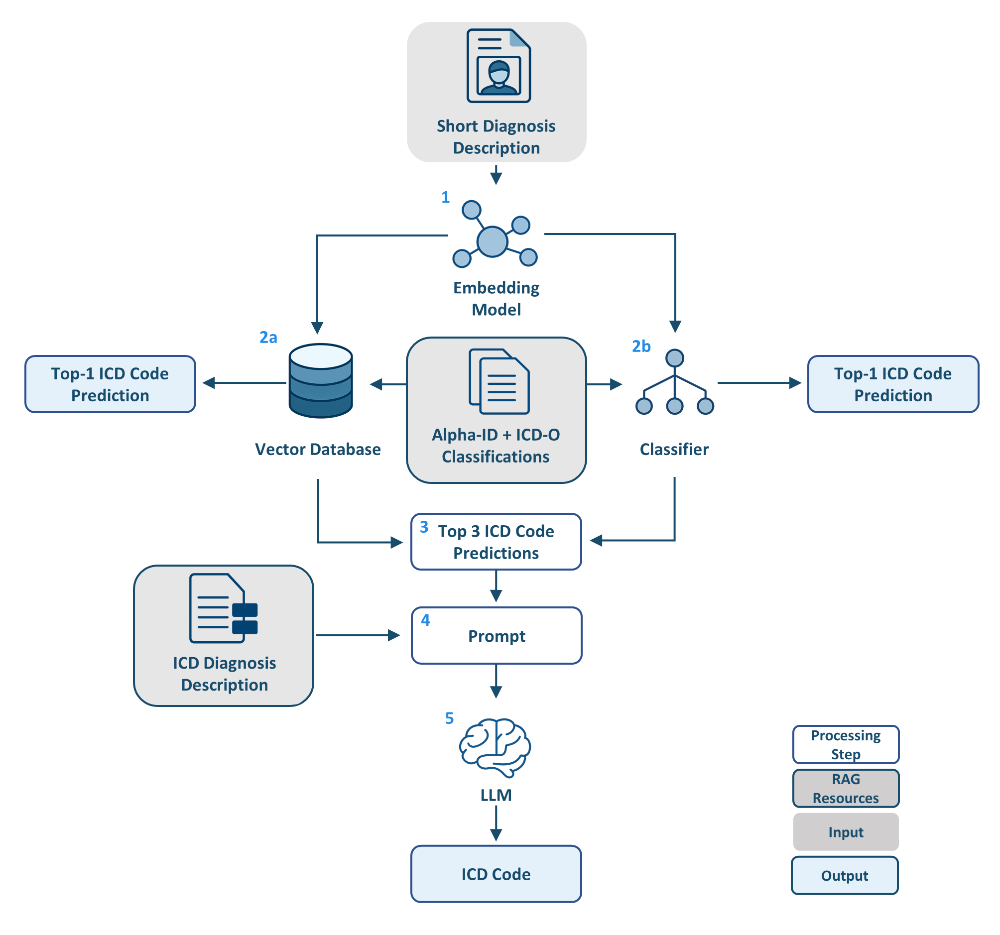

# RAG Pipeline for Automated ICD-10 and ICD-O Coding of German Tumor Diagnoses
This repository contains a Retrieval-Augmented Generation (RAG) pipeline for the automated ICD coding of German tumor diagnoses using embedding-based retrieval and base and fine-tuned Large Language Models (LLMs).

---

## RAG Pipeline

The RAG pipeline consists of the following main steps:



1. **Input diagnosis**
   A German tumor diagnosis is provided as free text.

2. **Preprocessing**
   The diagnosis text is cleaned and normalized.

3. **Embedding retrieval**
   The input diagnosis is converted into an embedding and compared with indexed reference examples.

4. **Context construction**
   The most relevant retrieved examples are added to the prompt as context.

5. **LLM-based coding**
   The language model predicts ICD-10 and/or ICD-O topography codes based on the diagnosis and retrieved context.

6. **Evaluation**
   The predicted codes are compared with reference codes using evaluation metrics such as exact match, precision, recall, and F1 score.

---

## Repository Structure

| Folder | Description |
|---|---|
| [`preprocessing/`](./preprocessing/) | Scripts for cleaning and normalizing German diagnosis texts. |
| [`data/`](./data/) | Overview of the used datasets. |
| [`classifier/`](./classifier/) | Classifier-based ICD prediction baseline. |
| [`similarity_search/`](./similarity_search/) | Embedding-based retrieval and nearest-neighbor search. |
| [`word2vec/`](./word2vec/) | Word2Vec-based retrieval baseline. |
| [`prompts/`](./prompts/) | Prompt templates and scripts for constructing LLM inputs. |
| [`rag/`](./rag/) | RAG-based ICD coding and evaluation pipeline. |
| [`configs/`](./configs/) | Experiment configuration files. |
| [`results/`](./results/) | Evaluation plots. |

---

## Usage

The repository is organized into separate components for ICD-10 and ICD-O code prediction. Scripts inside the main experiment folders ([`classifier/`](./classifier/), [`similarity_search/`](./similarity_search/), and [`word2vec/`](./word2vec/)) are numbered and should be executed in ascending order.

After running one or more of these approaches, use [`prompts/`](./prompts/) to construct prompts and [`rag/`](./rag/) to perform LLM-based ICD code prediction.

---

# Overview of the Used Datasets and Resources

| Dataset | Description | Availability |
|---|---|---|
| [`Alpha-ID_dataset/`](./data/Alpha-ID_dataset/) | BfArM terminology resource based on the Alphabetical Index of ICD-10-GM. It provides German diagnosis terms and corresponding ICD-10-GM codes. Used as a training dataset | Publicly available from BfArM. Subject to the [BfArM download conditions](https://www.bfarm.de/SharedDocs/Downloads/DE/Kodiersysteme/downloadbedingungen-2025.pdf?__blob=publicationFile). |
| [`ICD10_GM/`](./data/ICD10_GM/) | German Modification of ICD-10 provided by BfArM for diagnosis coding in Germany. Used for prompt construction. | Publicly available from BfArM. Subject to the [BfArM download conditions](https://www.bfarm.de/SharedDocs/Downloads/DE/Kodiersysteme/downloadbedingungen-2025.pdf?__blob=publicationFile). |
| `ICD-O-3` | International Classification of Diseases for Oncology, Third Edition. The German version is provided by BfArM. | Publicly available from BfArM: [BfArM ICD-O-3](https://www.bfarm.de/DE/Kodiersysteme/Klassifikationen/ICD/ICD-O-3/_node.html). Subject to the [BfArM download conditions](https://www.bfarm.de/SharedDocs/Downloads/DE/Kodiersysteme/downloadbedingungen-2025.pdf?__blob=publicationFile). |
| [`ICDO3_LE_dataset/`](./data/ICDO3_LE_dataset/) | Derived ICD-O-3 topography dataset created in this project by linking Alpha-ID diagnosis descriptions, ICD-10-GM codes, ICD-O-3 topography codes, and ICD-O-to-ICD-10 mapping information. Used as a training dataset and for prompt construction | Created in this project. |

---

# Characteristics of the ICD-O-3 LE dataset

**Version:** [v1.0]

**Short description:** This dataset contains 8,981 tumor-related entries in CSV format for tumor coding and code-mapping tasks.

The dataset was created by mapping Alpha-ID diagnosis descriptions to corresponding ICD-O-3 topography codes and ICD-10-GM codes using the conversion table for solid tumors.

---

## Dataset Contents

- Number of entries: 8,981
- Number of unique classes: 615 ICD-10 codes and 326 ICD-O-3 topography codes
- Data format: CSV

The main features included are:

- `ID`: unique identifier
- `ICD-10-Code`: ICD-10 code
- `ICD-O-Code`: ICD-O-3 topography code
- `ICD-10 Text`: ICD-10-GM diagnosis description (from ICD-O_ICD-10_Überleitung_Solide_Tumoren.CSV*)
- `Label`: Alpha-ID diagnosis description
- `Topography Text`: tumor localisation
- `Extended Label`: Alpha-ID diagnosis description + (topography text)
- `Prompt Text`: ICD-10-GM diagnosis description (from ICD-O_ICD-10_Überleitung_Solide_Tumoren.CSV*) + (topography text)

* The ICD-10 text was derived from the ICD-O to ICD-10 conversion table for solid tumors, which defines rules for mapping valid ICD-O-3 codes to corresponding ICD-10 codes.
## Source Resource
Umsetzungsleitfaden - Umsetzungsleitfaden - Plattform § 65c - Confluence Instanz [Internet]. [cited 2025 Nov 26].
Available from: https://plattform65c.atlassian.net/wiki/spaces/UMK/overview?homepageId=15532036

---

## Preprocessing

The following preprocessing steps were applied:

- Alpha-ID diagnosis descriptions were linked to ICD-O-3 topography codes through shared ICD-10 codes.
- Duplicate rows were removed.
- For `Extended Label`, the `Label` was used as the main text when the ICD-10 code mapped to only one ICD-O code. If an ICD-10 code mapped to multiple ICD-O codes, the `ICD-10 Text` was used instead to avoid ambiguity.
- `Topography Text` was added in brackets only when it was not already included in the text.
- Non-informative phrases such as `sonstige Lokalisation(en)` were removed.
- Abbreviations such as `o.n.A.` were replaced with `ohne nähere Angabe`.

---

## Data Availability and Privacy

The clinical tumor diagnosis texts used for evaluation cannot be publicly released due to data protection restrictions.

---

## Citation

If you use this repository, or the ICD-O-3 LE dataset, please cite:

```bibtex
@misc{alickovic2026ragicd,
  author       = {F. Alickovic, S. Lenz, A. Ustjanzew, L. O. Rosario, G. Vollmar, T. Kindler, T. Panholzer},
  title        = {To RAG, or Not to RAG? A Comparative Evaluation of Retrieval-Augmented Generation for ICD Coding of German Tumor Diagnoses},
  year         = {2026},
}


